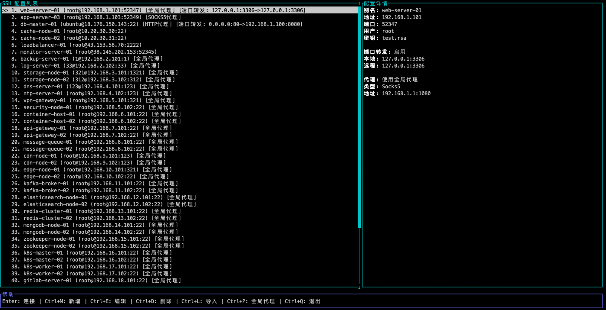
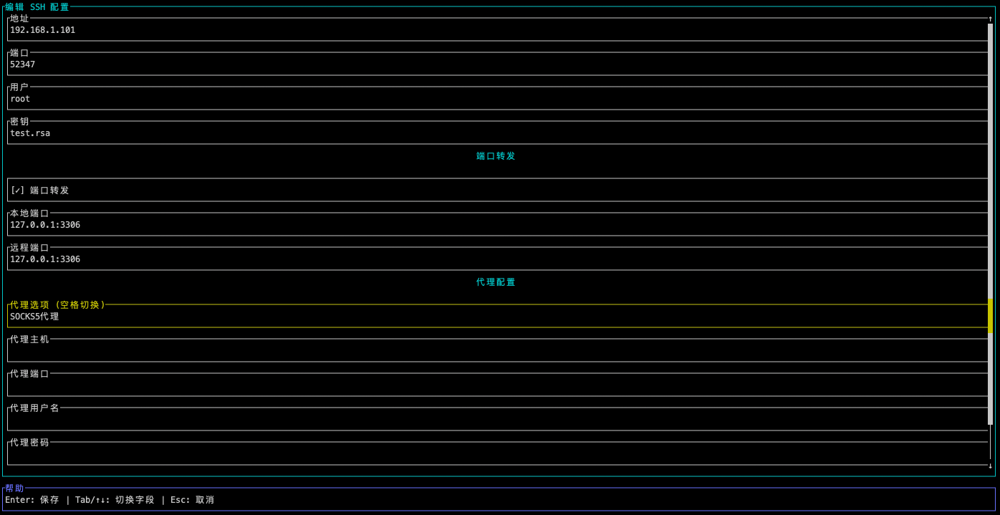
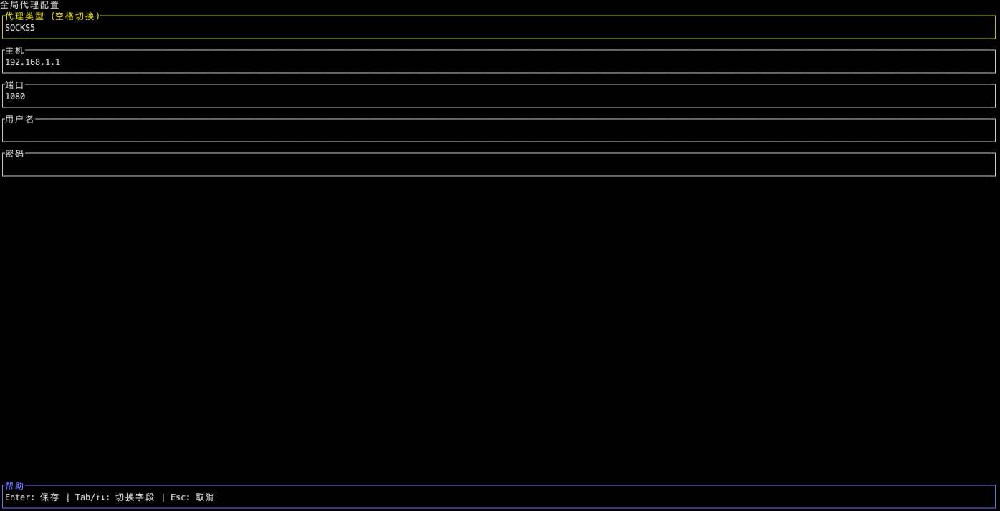

# MSSH

一个基于 Rust 和 TUI 的 SSH 配置管理工具，提供直观的终端用户界面来管理和连接 SSH 服务器。

## 📖 项目背景

从Win更换 Mac 后，始终找不到一个心仪的 SSH 管理软件。市面上的工具要么功能过于复杂，要么界面不够直观。基于个人使用需求，我开发了这个基于 Rust 和 TUI 的 SSH 配置管理工具 —— MSSH。

## ✨ 核心特性

### 🎯 主要功能

* 直观的 TUI 界面 - 现代化的终端用户界面，操作简单直观

* SSH 配置管理 - 添加、编辑、删除和查看 SSH 配置

* 快速连接 - 支持命令行参数快速连接指定服务器

* 配置导入 - 一键导入系统 SSH 配置文件

* 端口转发 - 完整的本地端口转发配置支持

* 代理支持 - 支持 SOCKS5 和 HTTP 代理，支持全局和自定义代理

## 待办
- [ ] 代理功能认证，仅开发界面

## 界面预览

> 主界面



> ssh设置界面
> 


> 导入～/.ssh/config界面
> 


> 全局代理配置
> 



## 安装

### 一键安装（推荐）

```bash
curl -fsSL https://raw.githubusercontent.com/Caterpolaris/mssh/main/install.sh | bash

```


## 使用方法

### 基本使用

```bash
# 启动 MSSH
mssh

# 使用自定义配置文件
mssh -c /path/to/config.toml

# 快速连接指定编号或别名的服务器
mssh -C 1
mssh 1
mssh test-server

# 导入系统 SSH 配置
mssh --import-ssh
```

## 使用场景

### 开发者的日常
```
# 快速连接到开发服务器
mssh dev-server

# 设置端口转发进行调试
# localhost:3000 -> dev-server:3000

# 通过代理连接到内网服务器
mssh internal-server

```

### 命令行参数

| 参数 | 描述 |
|------|------|
| `-c <PATH>` | 指定配置文件路径 |
| `-C <NUM>` | 快速连接指定编号的服务器 |
| `--import-ssh` | 导入系统 SSH 配置文件 |
| `--help` | 显示帮助信息 |

### 键盘快捷键

#### 主界面
- `↑/↓` - 上下选择配置
- `Enter` - 连接选中的服务器
- `Ctrl+N` - 添加新配置
- `Ctrl+E` - 编辑选中的配置
- `Ctrl+D` - 删除选中的配置
- `Ctrl+L/O` - 导入系统 SSH 配置
- `Ctrl+P` - 全局代理设置
- `Ctrl+Q` - 退出程序

#### 表单编辑
- `↑/↓` - 切换字段
- `Tab/Shift+Tab` - 切换字段
- `←/→` - 移动光标
- `Home/End` - 光标到行首/行尾
- `Ctrl+U` - 清空当前字段
- `Space` - 切换复选框/单选框
- `Enter` - 保存配置
- `Esc` - 取消编辑

#### 导入选择
- `↑/↓` - 选择配置
- `Space` - 选择/取消选择
- `Ctrl+A` - 全选/取消全选
- `Enter` - 确认导入
- `Esc` - 取消导入

## 配置文件

MSSH 使用 TOML 格式的配置文件，默认位置，方便备份：
- 当前目录：`./config.toml`
- 用户目录：`~/.mssh/config.toml`

## 功能说明

### SSH 配置管理
- **主机别名** - 为服务器设置易记的名称
- **连接地址** - SSH 服务器的 IP 地址或域名
- **端口** - SSH 服务端口（默认 22）
- **用户名** - SSH 登录用户名
- **密钥路径** - SSH 私钥文件路径

### 端口转发
- **本地端口** - 本地监听端口
- **远程端口** - 远程服务器端口

### 代理配置
- **全局代理** - 应用于所有配置的默认代理
- **自定义代理** - 为特定配置设置独立代理
- **代理类型** - 支持 SOCKS5 和 HTTP 代理

## 参与开发
[开发文档](DOC/README.md)

## 许可证

本项目采用 MIT 许可证 - 查看 [LICENSE](LICENSE) 文件了解详情。

## 致谢

- [Ratatui](https://github.com/ratatui-org/ratatui) - 优秀的 TUI 库
- [Crossterm](https://github.com/crossterm-rs/crossterm) - 跨平台终端操作
- Rust 社区的支持和贡献